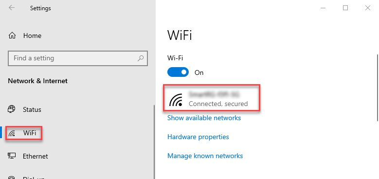
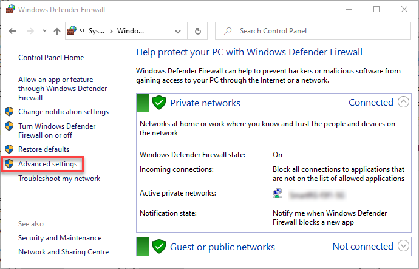

# Setting up your network and firewall on Windows

>**Note:** All instructions of this page apply to Windows only.

To enable a proper connection of the Live Capture apps with the Unity Editor:

-   Ensure that your client device and your Unity Editor workstation have access to the same network.

-   Disable any active VPNs.

-   On Windows 10:
  * Make sure the Wi-Fi network you are using is [set to Private](#private-wi-fi-network-setup).
  * In the Unity Editor, use the Connections window to [automatically configure your firewall](#automatic-firewall-configuration).
  * If you still can’t connect, [manually configure your firewall](#manual-firewall-rule-configuration). with a dedicated rule.

## Private Wi-Fi network setup

1.  In the Windows Settings, select **Network & Internet**.

    

2.  In the left panel, select **WiFi**, and then click on your connection on the right.

    

3.  In **Network profile**, select **Private**.

    

## Automatic firewall configuration

1.  Open the **Connections** window by selecting **Menu > Window > Live Capture > Connections**.

2.  If your firewall is not yet configured for Live Capture, the Connections window displays a "Firewall is not configured" message along with a **Configure Firewall** button. Click on this button.

3.  If a user account control message box pops up asking for administrator privileges, you must grant permission.

## Manual firewall rule configuration

> **Note:** The following instructions apply to the default Windows Defender firewall. If you're using any other 3rd party firewall, see its documentation to reproduce the same configuration.

1.  In the Windows **Control Panel**, go to **System and Security > Windows Defender Firewall**.

2.  In the left menu, select **Advanced Settings**.

    

3.  In the left pane, first select **Inbound Rules**.

    

4.  In the right pane, select **New Rule**.

    

5.  Perform the Program rule configuration steps through the New Inbound Rule Wizard according to your needs (see below).  

### Configuring a Program rule

Select **Next** each time to go to the next step.

| **Step**  | **Setting** |
|-----------|-------------|
| Rule Type | • Select **Program** (default). |
| Program   | • Select **This program path:** and then **Browse** to the `Unity.exe` file that corresponds to the Unity Editor that you want to connect the apps to. |
| Action    | • Select **Allow the connection** (default). |
| Profile   | • Select the profile that corresponds to the network you're using, and keep the other profiles unselected.  For example, for a private network, select **Private** and keep **Domain** and **Public** unselected. |
| Name      | • Enter **Unity Live Capture**, for example. |
